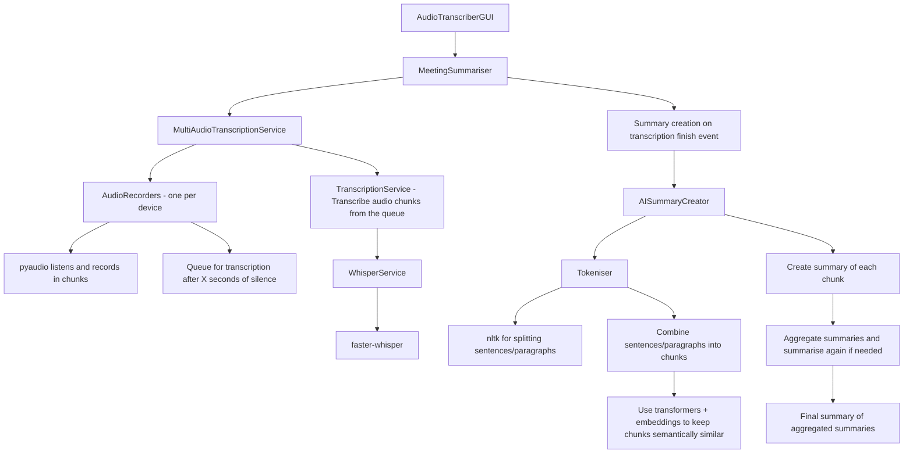

# Architecture

- AudioTranscriberGUI (meetingsummariser.gui.audio_transcriber_gui); main window GUI
  - Creates and runs MeetingSummariser (meetingsummariser.meeting_summariser)
    - This creates a MultiAudioTranscriptionService (meetingsummariser.multiaudio_transcription_service). 
      - This creates AudioRecorders (one per device chosen - meetingsummariser.audio.audio_recorder)
        - These use pyaudio to listen to a device, and record audio in chunks
        - When X seconds of silence has been reached, the chunk is stopped and added to a queue for transcription, and a new chunk started
      - MultiAudioTranscriptionService also created a TranscriptionService (meetingsummariser.transcriptions.transcription_service)
        - As audio chunks are added to the queue, the TranscriptionService reads from the queue and transcribes them one at a time
          - For transcription it uses the WhisperService class (meetingsummariser.transcriptions.whisper_service), which uses [faster-whisper](https://github.com/SYSTRAN/faster-whisper) for transcribing
      - Once the stop button has been pressed by the user, the audio recorders stop. Once the transcription service has finished transcribing the entire queue, an event is fired
    - The meetings ummariser receives the transcription finished event, and starts creating a summary of the transcript. This is done using the AISummaryCreator (meetingsummariser.summaries.ai_summary_creator)
      - The AISummaryCreator uses splits the transcript into sentences and paragraphs using a tokeniser (the Tokeniser class - meetingsummariser.transcriptions.tokeniser)
        - This is done by nltk
        - It then adds sentences together to reach a minimum word length. It then continues up to a maximum word length, OR until the next sentence is too different semantically
          - The semantics is done using transformers; currently just Bert models, and local transformers
      - Once the transcript has been chunked, the AISummaryCreator transcribes it by:
        - Creating a summary of each individual chunk
        - Once all summaries are done, we create a summary of an _aggregate_ of summaries
        - Once all the aggregates are done, we repeat aggregating + summarising (if needed) up to a maximum count of summaries
        - We then summarise the final aggregated summaries

